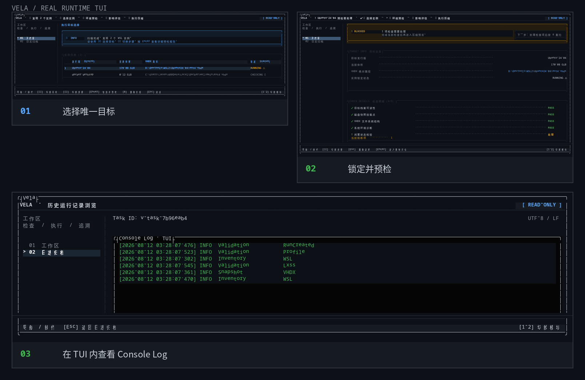
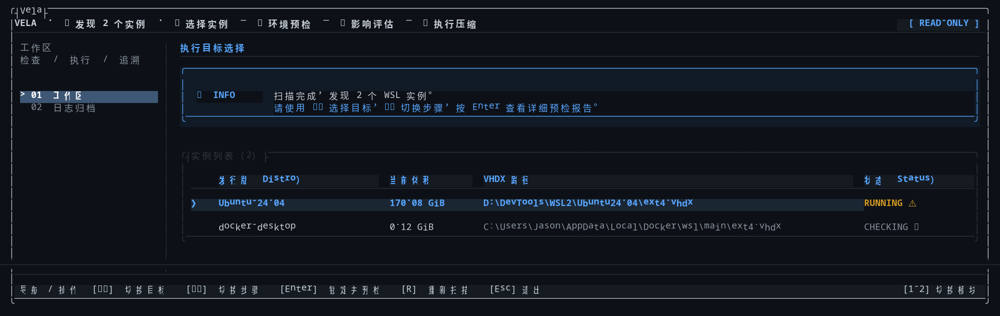
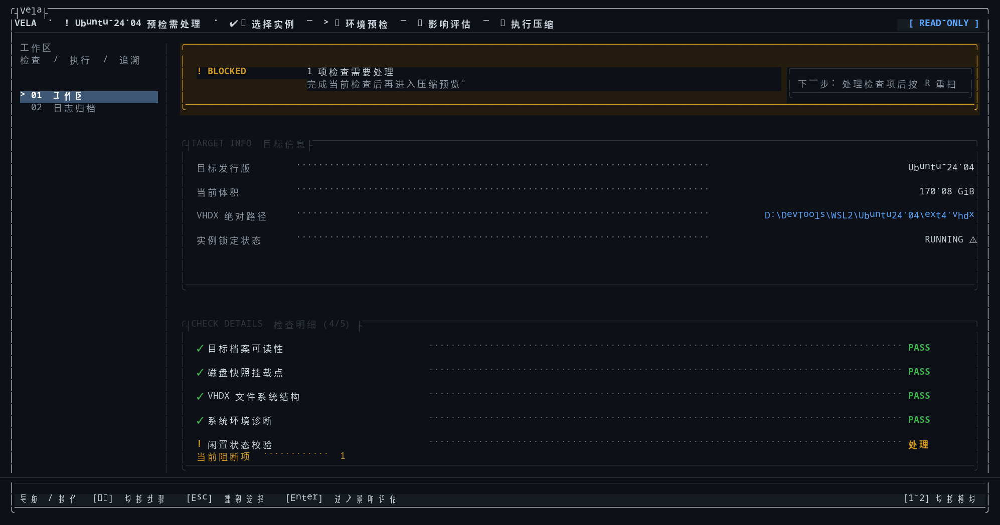
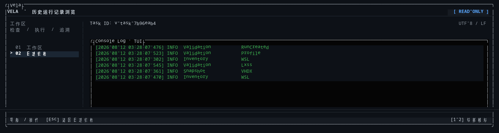

# Vela

### 把 WSL VHDX 压缩变成一条可审阅、可回溯的运行链。

Windows 11 · WSL2 · Keyboard-first TUI

[快速开始](#快速开始) · [真实运行画面](#真实运行画面) · [产品流程](#一条可审阅的运行链) · [键盘交互](#键盘交互) · [工程文档](#工程文档)

  

真实 Release TUI · 只读预检链路 · 目标锁定后才进入后续步骤

> **选中哪一个，就只处理哪一个。**
>
> Vela 面向 Windows 11 提供键盘优先的 WSL VHDX 工作流：发现实例 → 只读预检 → 锁定目标 → 影响评估 → 两次 Y 确认 → 执行与留痕。

## 先看 Vela 在解决什么

Vela 解决的不是“如何输入一条 compact 命令”，而是压缩前的三个决策问题：

| 决策 | Vela 给出的答案 |
| --- | --- |
| **目标是谁** | 从发现的 WSL 实例中选择，并锁定为本次唯一目标。 |
| **现在能不能做** | 用映射、VHDX 快照、运行状态、日志和阻断项建立预检证据。 |
| **做完留下什么** | 显示预计可回收空间、影响范围、实时日志和历史结果。 |

预计可回收空间采用可复核的估算公式：

~~~text
预计可回收空间 = max(VHDX 当前体积 - 访客文件系统已用空间, 0)
~~~

这是执行前估算；最终释放量以压缩完成后的 VHDX 快照差值为准。

## 真实 TUI 画面

下面的素材直接来自当前 Release 构建在 tmux 中的运行画面，不是 UI 原型图。采集覆盖只读路径；没有启动 WSL 停止或 VHDX 压缩。

### 01 / 选择唯一目标

  

屏幕先回答“**这次准备处理哪一个实例**”：当前环境发现 `Ubuntu-24.04` 与 `docker-desktop`，表格同时给出当前体积、VHDX 路径摘要和运行状态。蓝色箭头只指向当前选中目标。

### 02 / 锁定并预检

  

锁定后，目标信息和检查明细收拢到同一页：`Ubuntu-24.04`、`170.08 GiB`、绝对 VHDX 路径、4 项 `PASS` 与 1 项阻断项一一对应。这里的 `BLOCKED` 是当前机器的真实状态，不用模拟成功结果掩盖风险。

### 03 / 日志留在 TUI 内

  

历史运行记录进入 TUI 内置的 `Console Log` 视图，包含 `Task ID`、时间戳、事件类别和阶段名称。查看日志不需要打开日志目录，也不需要切换到另一个窗口。

截图采集说明

- Release 构建：`Vela.Tui.dll`
- 终端画布：`178 × 42`
- 采集路径：实例选择 → 目标预检 → 日志归档 → Console Log
- 采集范围：只读数据读取与界面浏览

## 产品能力

| 能力 | Vela 做什么 | 用户得到什么 |
| --- | --- | --- |
| **只读预检** | 读取发行版清单、Lxss 映射、VHDX 快照、稀疏状态、宿主盘容量、运行实例和日志可用性 | 先看清状态，再决定是否继续 |
| **多实例选择** | 在 TUI 中浏览实例，显示发行版、当前体积、VHDX 路径摘要和状态 | 不会把压缩动作落到错误实例 |
| **目标锁定** | Enter 锁定当前选中的发行版，后续影响评估和执行只围绕这个目标 | “选中的哪一个，就压缩哪一个” |
| **影响评估** | 估算当前体积、访客已用空间和预计可回收空间；展示 Global / Distro 影响范围 | 执行前知道可能停止哪些 WSL 实例 |
| **双重确认** | 影响预览按 Y 进入确认页，再按一次 Y 启动提升权限 worker | 把误触变成两步明确决策 |
| **提升权限执行** | 由 UAC worker 重新解析目标映射、复跑关键预检，再调用 WSL 与 DiskPart | 父 TUI 与实际目标之间有二次校验 |
| **TUI 日志归档** | 在 Vela 内查看实时事件、运行日志和历史摘要 | 不需要打开日志目录或切换窗口 |
| **档案与历史** | 管理多个目标档案，查看最近运行的结果、耗时、回收空间和日志状态 | 日常使用有固定入口，运行结果可回看 |

## 一条可审阅的运行链

~~~text
发现 WSL 实例
      │
      ▼
只读预检 ──► 目标选择 ──► 目标锁定
                              │
                              ▼
                      影响评估 / 预计可回收空间
                              │
                         Y → Y 确认
                              │
                              ▼
                 UAC worker + 目标二次校验
                              │
                              ▼
                    WSL 停止 → DiskPart compact
                              │
                              ▼
                VHDX 复测 → TUI 日志 → 历史结果
~~~

### 预检门禁

预检按固定顺序建立证据：

1. 注册表 / Lxss 映射
2. VHDX 快照
3. 运行实例
4. 日志可用性
5. 通知与阻断项

只有预检状态允许继续时，执行压缩入口才会解锁。预检本身不触发 WSL 停止、发行版终止或 DiskPart compact。

### 预计可回收空间

Vela 优先离线读取目标 VHDX 的 ext4 使用量；目标已在运行且离线证据不可用时，才按目标发行版执行只读 df 采集。目标未运行时不会为了估算而启动在线采集。

## 执行护栏

Vela 将“看状态”和“做改变”分成两条清晰边界：

- **预检是只读的**：只采集证据，不停止 WSL，不终止发行版，不调用 DiskPart。
- **一个操作只对应一个目标**：锁定发行版后，影响评估、确认和执行都使用同一个目标档案。
- **worker 不信任旧快照**：提升权限后按发行版重新读取 HKCU Lxss 映射，并将解析出的 VHDX 路径与请求路径严格比对。
- **单 worker gate**：同一数据根内同时只允许一个 Compact worker 进入执行链。
- **路径与参数有边界**：原生工具使用固定绝对路径和 ArgumentList，DiskPart 脚本只来自通过校验的目标路径。
- **原始证据留在日志**：TUI 对路径做清洗和长度限制，列表与影响面板只展示必要摘要；RunId、异常堆栈和 native output 留在日志中。

## 键盘交互

Vela 的输入由单一 TUI 入口串行处理，页面之间不启动嵌套读键循环。

| 按键 | 作用 |
| --- | --- |
| ↑ / ↓ | 移动菜单、实例或列表选择 |
| ← / → | 在支持横向工作流的页面切换视图 |
| Enter | 执行当前菜单项、锁定目标、打开详情或进入下一步 |
| R / r | 重新运行只读预检 |
| Esc | 返回上一层、取消确认；主菜单退出 |
| Y → Y | 影响预览进入确认，再启动压缩 worker |
| N / E / D | 新建、编辑、删除目标档案 |

首启和会改变执行目标的档案编辑 / 删除确认使用精确的大写 YES 加 Enter。压缩流程只使用两次 Y，不要求输入 YES。

## 快速开始

### 环境要求

| 项目 | 要求 |
| --- | --- |
| 操作系统 | Windows 11 |
| 目标环境 | 已安装并可正常运行的 WSL 发行版 |
| SDK | .NET SDK 10.0.302，允许最新补丁版本 |
| 终端 | Windows Terminal 或 Developer PowerShell for VS 2022 |
| 执行权限 | 预检可使用普通权限；真正压缩阶段由 UAC worker 提升权限 |

### 从源码运行

~~~powershell
git clone https://github.com/xianyudd/Vela.git
Set-Location .\Vela
dotnet restore .\Vela.sln -r win-x64 --locked-mode --ignore-failed-sources -p:EnableRuntimePackDownload=false -p:DisableTransitiveFrameworkReferenceDownloads=true
dotnet run --project .\src\Vela.Tui\Vela.Tui.csproj --no-restore
~~~

首次启动会先展示本地数据目录初始化摘要。输入精确的 YES 后，Vela 才会创建配置、pending 请求目录和日志目录。默认档案是 Ubuntu-24.04，首次使用前请在“管理目标档案”中核对发行版和 VHDX 配置。

### 构建单文件发布物

发布 profile 已固定为 win-x64、自包含、单文件、包含原生库且不裁剪：

~~~powershell
dotnet build .\Vela.sln -c Release --no-restore
dotnet test .\Vela.sln -c Release --no-build
dotnet publish .\src\Vela.Tui\Vela.Tui.csproj -c Release --no-restore -p:PublishProfile=win-x64-singlefile -o .\artifacts\publish\win-x64
~~~

发布结果：

~~~text
artifacts\publish\win-x64\Vela.exe
~~~

开发、测试和发布输出统一留在项目内 artifacts\，不会直接写入日常安装目录。

## 运行记录

发布版默认使用 %LocalAppData%\Vela：

~~~text
%LocalAppData%\Vela\
├─ config.json
├─ pending\<RunId>.json
└─ logs\<RunId>\
   ├─ events.ndjson   # 实时事件流
   ├─ run.log         # 人类可读日志
   └─ summary.json    # 历史结果摘要
~~~

运行中的事件由父 TUI 轮询同一份 journal，并在“运行进度”和“日志归档”中呈现。影响预览展示预计可回收空间；最近运行详情记录结果、开始 / 完成时间、耗时、实际回收空间以及日志可用状态。

## 结果语义

| 结果 | 含义 |
| --- | --- |
| Succeeded | 压缩完成并产生可回收空间 |
| CompletedWithNoReclaim | 流程完成，但 VHDX 长度未减少 |
| ValidationFailed | 目标、映射、快照或请求校验未通过 |
| ShutdownTimedOut | 运行中的 WSL 未在配置时间内停止 |
| DiskPartPreflightFailed | DiskPart 预检阶段失败，未进入 compact |
| DiskPartCompactFailed | DiskPart compact 阶段失败 |
| CancelledBeforeElevation | 用户取消 UAC 或提升权限启动 |
| WorkerInterrupted | worker 未能正常完成运行链 |

## 项目结构

~~~text
Vela/
├─ src/
│  ├─ Vela.Core/        # 不依赖 Windows API 的模型、验证与工作流
│  ├─ Vela.Windows/     # WSL、注册表、VHDX、DiskPart、UAC 与日志适配器
│  └─ Vela.Tui/         # Terminal.Gui 外壳、页面、状态投影与渲染
├─ tests/
│  └─ Vela.Tests/       # Core、Windows adapter 与 TUI 测试
├─ docs/                # 架构、环境、测试与发布手册
├─ scripts/             # 覆盖率与只读 TUI 验收脚本
├─ Directory.Build.props
├─ Directory.Packages.props
└─ Vela.sln
~~~

依赖方向保持单向：

~~~text
Vela.Tui ─────► Vela.Core
    │
    └──────────► Vela.Windows ─────► Vela.Core
~~~

## 开发与质量门禁

~~~powershell
dotnet restore .\Vela.sln -r win-x64 --locked-mode --ignore-failed-sources -p:EnableRuntimePackDownload=false -p:DisableTransitiveFrameworkReferenceDownloads=true
dotnet build .\Vela.sln -c Release --no-restore
dotnet test .\Vela.sln -c Release --no-build
dotnet test .\tests\Vela.Tests\Vela.Tests.csproj -c Release --no-restore -p:CollectCoverage=true -p:CoverletOutput=.\artifacts\coverage\coverage -p:CoverletOutputFormat=cobertura -p:Include='[Vela.Core]*,[Vela.Windows]*' -p:ExcludeByFile='**/Program.cs'
pwsh -NoProfile -File .\scripts\Verify-Coverage.ps1
~~~

质量基线：锁定依赖恢复成功、全量测试通过、零编译警告，且 Vela.Core 与 Vela.Windows 的 line coverage 各自不低于 80%。详细验收矩阵和真实 Win11 / WSL 验收边界见[测试与发布手册](docs/testing-and-release.md)。

## 当前边界

Vela 当前聚焦单机 Windows 11 工作流：档案、预检、目标锁定、影响评估、压缩执行、TUI 日志和历史记录。计划任务、云同步、远程主机管理和自动定期执行不属于当前产品范围。

## 工程文档

- [架构设计](docs/architecture.md)：产品边界、TUI 状态流、worker 协议、日志与 Windows 适配层。
- [开发环境](docs/development-environment.md)：Visual Studio、Windows SDK、目录约定和开发期写入边界。
- [测试与发布](docs/testing-and-release.md)：测试矩阵、覆盖率 gate、TUI 验收、发布 profile 和交付清单。
- [实施计划](docs/implementation-plan.md)：从解决方案初始化到发布验收的历史实施记录。

## 项目状态

Vela 目前处于 private preview：核心 TUI 流程、目标锁定、只读预检、预计可回收空间、双重 Y 确认、UAC worker、TUI 日志归档和自动化测试已接入；真实 WSL / DiskPart 压缩仍应在明确影响范围后进行最终人工验收。

**先预检，再锁定；先看影响，再执行。**

